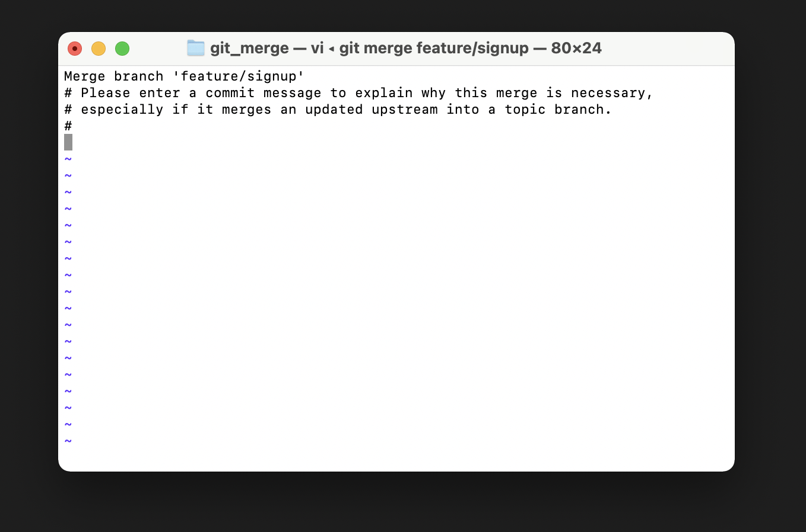

# branch scenario

### 1. branch 사용법

```bash
# 4개 정도 commit을 남기고 시작한다.
$ git log --oneline
0f0ab00 (HEAD -> master) text 3
706faf6 text 2
eebf263 text 1
7d8c0e4 Finish a.txt
```

- `HEAD` 

  - 현재 위치한 브랜치의 최신 commit을 가리키는 (일종의) 포인터
  - 현재 `HEAD`는 다음 commit의 부모 commit이 된다.

  - 현재 내가 어떤 곳에 위치해있는지를 알 수 있다.


```bash
# 브랜치 생성
$ git branch feature/login
$ git branch
  feature/login
* master

$ git log --oneline
0f0ab00 (HEAD -> master, feature/login) text 3
706faf6 text 2
eebf263 text 1
7d8c0e4 Finish a.txt

```

```bash
# a.txt

text 1
text 2
text 3
master text 4 # master 브랜치에서 작성
```

```bash
$ git add .
$ git commit -m "master text 4"
[master 3173bc7] master text 4
 1 file changed, 2 insertions(+), 1 deletion(-)
```


```bash
$ git log --oneline
3173bc7 (HEAD -> master) master text 4 # 현재 내가 위치한 master 브랜의 최신 commit
0f0ab00 (feature/login) text 3 # feature/login 브랜치의 commit
706faf6 text 2
eebf263 text 1
7d8c0e4 Finish a.txt
```


브랜치 이동

```bash
$ git checkout feature/login
Switched to branch 'feature/login'

$ git log --oneline
0f0ab00 (HEAD -> feature/login) text 3
706faf6 text 2
eebf263 text 1
7d8c0e4 Finish a.txt

```

```bash
# a.txt (feature/login 브랜치에서 작성)
text 1
text 2
text 3
login text 4
```


## 2. Branch Merge

```bash
# 기본 준비

$ mkdir git_merge && cd git_merge
$ git init
$ touch a.txt  # 내용 채우고
$ git add .
$ git commit -m "master text 1"
```


### 2-1. fast-forward

> 다른 브랜치가 생성된 이후에 master 브랜치에 변경사항이 없는 경우

-  단순히 포인터를 최신 commit으로 옮기는 방식


```bash
# 브랜치 생성 & 이동
$ git checkout -b feature/login
Switched to a new branch 'feature/login'

# login 작업 진행
$ touch login.txt
$ git add .
$ git commit -m "login test 1"
[feature/login 84ae69b] login test 1
 1 file changed, 0 insertions(+), 0 deletions(-)
 create mode 100644 login.txt

# log 
$ git log --oneline
84ae69b (HEAD -> feature/login) login test 1
da5f933 (master) master text 1

# master 브랜치로 이동
$ git checkout master
Switched to branch 'master'

# log
$ git log --oneline
da5f933 (HEAD -> master) master text 1

# merge
$ git merge feature/login
Updating da5f933..84ae69b
Fast-forward
 login.txt | 0
 1 file changed, 0 insertions(+), 0 deletions(-)
 create mode 100644 login.txt
 
 # branch 삭제
$ git branch -d feature/login
Deleted branch feature/login (was 84ae69b).

# log
$ git log --oneline
84ae69b (HEAD -> master) login test 1
da5f933 master text 1
```


### 2-2. Merge commit - 충돌 x

> 다른 브랜치가 생성된 이후에 master 브랜치에 변경사항이 있는 경우 

- `master` 브랜치와 `feature/signup`  브랜치에 모두 commit 발생
- 하지만 다른 파일을 수정 했기 때문에 merge 과정에서 충돌이 발생하지 않음 


```bash
# 브랜치 생성 후 이동
$ git checkout -b feature/signup
Switched to a new branch 'feature/signup'

# 회원 가입 기능 구현 완료(commit)
$ touch signup.txt
$ git add .
$ git commit -m "singup text 1"
[feature/signup 7019b0f] singup text 1
 1 file changed, 0 insertions(+), 0 deletions(-)
 create mode 100644 signup.txt

# log
$ git log --oneline
7019b0f (HEAD -> feature/signup) singup text 1
84ae69b (master) login test 1
da5f933 master text 1

# master 브랜치로 이동 & commit 발생 시키기
$ git checkout master
$ touch master.txt
$ git add .
$ git commit -m "master text 1"

# merge -> vs code가 열림 -> 닫아주면 자동으로 merge commit 발생
$ git merge feature/signup
Merge made by the 'recursive' strategy.
 signup.txt | 0
 1 file changed, 0 insertions(+), 0 deletions(-)
 create mode 100644 signup.txt


```


- 참고 
  - 혹시나 아래와 같은 화면이 나타나면서 움직이지 않는다면?
  - `esc` + `:wq` + `enter` !! 


### 2-3. Merge commit - 충돌 o

> 다른 브랜치가 생성된 이후에 master 브랜치에 변경사항이 있는 경우 

